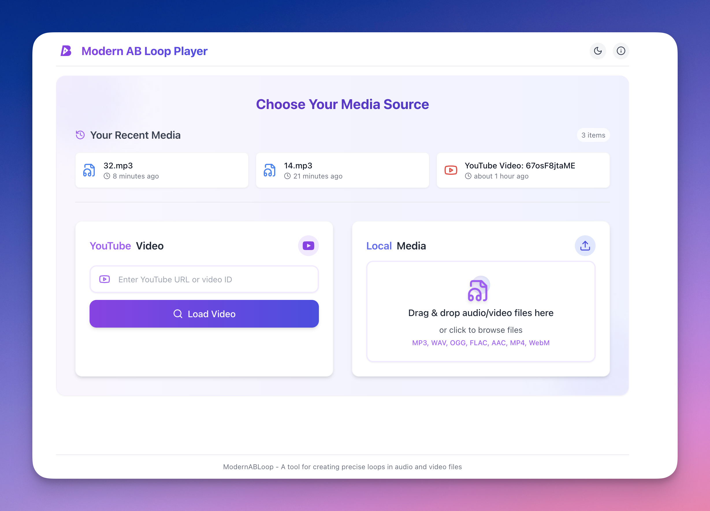
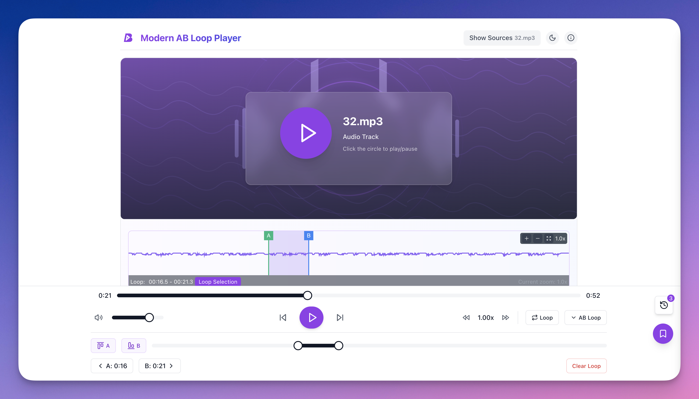
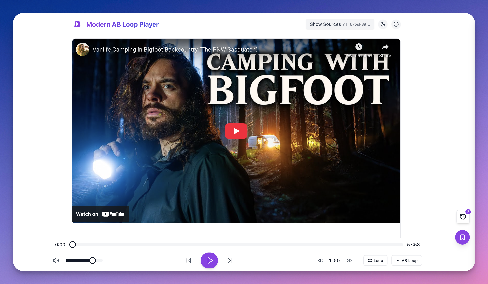

# LoopMate

A modern web-based audio/video loop player with A-B repeat
A sleek and intuitive web app for looping YouTube videos and local audio/video files with precision A-B points—perfect for language learners, musicians, and content reviewers.
🎯 Supports MP3, MP4, WebM, FLAC, and more
📼 Drag & drop local files or paste a YouTube link
🔁 Set custom loop points to focus on what matters





## ✨ Features

- **Audio/Video Playback** - Supports both audio and video file formats
- **A-B Loop** - Set precise loop points with start and end markers
- **YouTube Integration** - Load and loop YouTube videos directly
- **Bookmarking** - Save and manage timestamps for quick navigation
- **Waveform Visualization** - Visual representation of audio for precise navigation
- **Keyboard Shortcuts** - Full keyboard control for efficient workflow
- **Responsive Design** - Works on desktop and mobile devices
- **Dark/Light Theme** - Choose your preferred color scheme
- **Local Storage** - Saves your recent files and bookmarks
- **Shareable URLs** - Share timestamps with others via URL

## 🛠 Tech Stack

- **Frontend**

  - React 18 with TypeScript
  - Vite (Build Tool)
  - Tailwind CSS (Styling)
  - Radix UI (Accessible UI Primitives)
  - Framer Motion (Animations)
  - Zustand (State Management)

- **Audio Processing**
  - Web Audio API
  - Custom audio processing utilities

## 🚀 Getting Started

### Prerequisites

- Node.js 16+ and npm/yarn
- Modern web browser with Web Audio API support
- Vercel account (for deployment)

### Deploy to Vercel

Deploy your own instance of LoopMate with one click:

[](https://vercel.com/new/clone?repository-url=https%3A%2F%2Fgithub.com%2Fyourusername%2Fmodern-ab-loop&project-name=modern-ab-loop&repository-name=modern-ab-loop)

Or deploy manually:

1. Install Vercel CLI: `npm install -g vercel`
2. Run `vercel` in the project directory and follow the prompts
3. For production: `vercel --prod`

### Local Development

### Installation

1. Clone the repository:

```bash
git clone https://github.com/yourusername/modern-ab-loop.git
cd modern-ab-loop
```

2. Install dependencies:

```bash
npm install
# or
yarn install
```

3. Start the development server:

```bash
npm run dev
# or
yarn dev
```

4. Open your browser and navigate to `http://localhost:5173`

## 🎛 Usage

1. **Upload Media**

   - Click "Open File" to upload audio/video files
   - Or enter a YouTube URL to load a video

2. **Basic Controls**

   - Play/Pause: Spacebar or Play/Pause button
   - Seek: Click on the timeline or use Left/Right arrow keys
   - Volume: Use the volume slider or Up/Down arrow keys

3. **A-B Looping**

   - Set point A: Press `A` key or click "Set A"
   - Set point B: Press `B` key or click "Set B"
   - Toggle loop: Press `L` key or click the loop button

4. **Bookmarks**
   - Add bookmark: Press `M` key or click "Add Bookmark"
   - Jump to bookmark: Click on a bookmark in the list
   - Delete bookmark: Hover over a bookmark and click the delete icon

## 🎨 Project Structure

```
src/
├── components/            # Reusable UI components
│   ├── controls/         # Player control components
│   ├── layout/           # Layout components
│   ├── player/           # Media player components
│   ├── ui/               # Base UI elements
│   └── waveform/         # Waveform visualization
├── hooks/                # Custom React hooks
├── stores/               # State management
└── utils/                # Utility functions
```

## 📝 License

This project is licensed under the MIT License - see the [LICENSE](LICENSE) file for details.

## 🙏 Acknowledgments

- Built with modern web technologies
- Inspired by professional audio/video editing software
- Special thanks to all contributors and open-source libraries used

3. Build for production:

```bash
npm run build
```

## Keyboard Shortcuts

- **Spacebar:** Play/Pause
- **A:** Set A point at current time
- **B:** Set B point at current time
- **L:** Toggle loop on/off
- **C:** Clear loop points
- **←/→:** Seek backward/forward 5 seconds
- **Shift + ←/→:** Seek backward/forward 1 second
- **↑/↓:** Volume up/down
- **0-9:** Jump to 0-90% of track

## License

MIT
